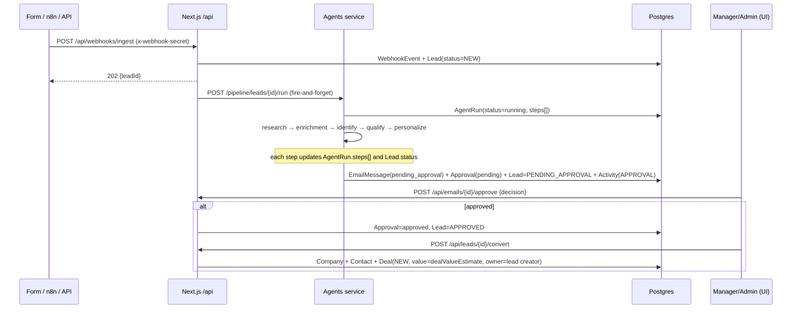

# Architecture — AI Sales CRM

## System diagram

```mermaid
flowchart TB
    subgraph clients[Clients]
        U[Browser\nCRM users]
        EXT[External systems\nform posts, partner apps]
    end

    subgraph web[apps/web — Next.js 15 :3000]
        UI[App Router UI\nDashboard · Leads · Kanban · Approvals · Admin]
        API[/Route handlers \/api\/*\nRBAC: requireAuth(roles?)/]
        AUTH[Auth.js v5\nCredentials + JWT sessions]
        UI --> API
        U --> UI
        AUTH --- API
    end

    subgraph agents[services/agents — FastAPI :8000]
        EP[HTTP API\n/pipeline/* · /webhooks/inbound · /automations/*]
        PIPE[Pipeline orchestrator\nresearch → enrichment → identify → qualify → personalize]
        QUEUE[Worker loop\nPipelineJob table as queue, retries, DEAD after max attempts]
        LLM[LLM providers\nmock | openai | anthropic]
        EP --> QUEUE
        QUEUE --> PIPE
        PIPE --> LLM
    end

    subgraph n8n[n8n :5678]
        WF1[Webhook: lead-intake]
        WF2[Schedule: followup-trigger hourly]
    end

    subgraph data[Data stores]
        PG[(Postgres :5433\nai_sales_crm)]
        RD[(Redis :6380\njob locks SET NX)]
    end

    U -->|/api/webhooks/ingest| API
    EXT -->|POST /webhook/lead-intake| WF1
    WF1 -->|POST /webhooks/inbound\nx-webhook-secret| EP
    API -->|POST /pipeline/leads/{id}/run\nx-webhook-secret| EP
    WF2 -->|POST /automations/n8n/trigger-followups| EP
    API -->|Prisma| PG
    EP -->|SQLAlchemy / psycopg| PG
    PIPE -->|SET NX locks| RD
```

Both servers talk to the same Postgres database; the web app owns CRM mutations and conversion, the agents service owns AI artifacts (Lead research/enrichment/qualification columns, AgentRun, PipelineJob, EmailMessage drafts, Approval rows, AGENT_RUN/ENRICHMENT/QUALIFICATION activities). Contracts live in `local/contracts.md` — the single source of truth for enums, API shapes, env names and the RBAC matrix.

## Data flow: lead → approved email → deal



Failure path: any pipeline step throws → `Lead.status=FAILED`, `AgentRun.status=failed` with the error recorded; the PipelineJob retries (`RETRYING`) until `maxAttempts`, then `DEAD` with `lastError` persisted. A lead with an active run rejects new runs with 409 (Redis `SET NX` lock + run check). Qualification can short-circuit: tier `UNQUALIFIED` → `Lead.status=REJECTED`, pipeline stops.

## Follow-up automations

- n8n Schedule Trigger (hourly) → `POST /automations/n8n/trigger-followups` → agents selects APPROVED leads older than 24h (and open deals needing a touch) → enqueues `followup` PipelineJobs → drafts new EmailMessages referencing the previous outbound email body → same approval queue.

## Key invariants

- **RBAC** is enforced in the web API layer only (`requireAuth(roles?)`): SALES_REP writes only `ownerId == session.user.id` records; approvals require MANAGER/ADMIN; VIEWER is read-only; admin routes are ADMIN-only.
- **Audit**: every mutating web endpoint writes an AuditLog row `{action, entityType, entityId, before?, after?}`.
- **Secrets**: agents and n8n share `WEBHOOK_SECRET` via the `x-webhook-secret` header; `/health` is the only unauthenticated agents endpoint.
- **Ports**: web 3000, agents 8000, postgres 5433, redis 6380, n8n 5678.
- **Deployment**: `apps/web` builds as a standalone Next.js server (`output: "standalone"`, required by `apps/web/Dockerfile`); agents image is a frozen `uv sync` of `pyproject.toml`/`uv.lock` over `python:3.13-slim`; n8n auto-imports `n8n/workflows/*.json` at container start.
